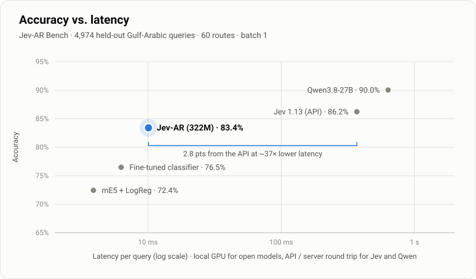

<div align="center">

# Jev-AR

### Fast, calibrated Arabic intent routing for MSA, Gulf dialects and code-switched Arabic, in a single forward pass

[](https://huggingface.co/atmaneayoub/jev-ar)
[](https://huggingface.co/datasets/atmaneayoub/jev-ar-bench)


[](https://creativecommons.org/licenses/by-nc/4.0/)
[](LICENSE)

</div>

Jev-AR reads a message and **a list of routes you supply at request time** (a RAG app's knowledge bases, a
helpdesk's queues, an assistant's intents) and scores every route in one forward pass. It returns the best route,
a calibrated probability for each one, and an **escalate** flag when it isn't confident enough to act.

<p align="center">
  
</p>

## Highlights

- **Close to a closed API, at a fraction of the latency.** 83.4% on 60-way Gulf-Arabic routing, 2.8 points from
  Jev 1.13, at about 10 ms per query on one GPU.
- **On par with Jev on 20-route lists.** 90.0% vs 91.4%; the difference is not statistically significant.
- **The strongest model under 1B parameters we evaluated.** It is 6.9 points above a classifier fine-tuned from
  the same encoder, and 11.0 points above multilingual-E5 with logistic regression.
- **Your routes, no retraining.** It scored 38/40 on a RAG app from an industry absent from training, and no answer
  changed when the route list was reversed.
- **Built for production.** It has calibrated confidence and a 95%-accuracy escalation threshold, and it is about
  1% the size of a 27B LLM.

## Results

**Jev-AR Bench**: 4,974 held-out Gulf-Arabic queries (MSA, Emirati, Saudi, code-switched). Accuracy in %, with 95%
confidence intervals.

| Model | Params | Deployment | 60 routes | 20 routes | Latency (p50) |
|:--|:--:|:--:|:--:|:--:|:--:|
| Qwen3.8-27B (LLM, list in prompt) | 27B | GPU server | 90.0 | 94.0 | 634 ms † |
| Jev 1.13 (TypeSafe) | undisclosed | closed API | 86.2 | 91.4 | 370 ms † |
| **Jev-AR** | **307M** | **local** | **83.4** <sub>[81.2–85.4]</sub> | **90.0** <sub>[88.4–91.4]</sub> | **10 ms** |
| mmBERT-base, fine-tuned classifier | 307M | local | 76.5 | 79.8 | 6 ms |
| multilingual-E5-base + logistic regression | 278M | local | 72.4 | 77.4 | 4 ms |

<sub>Batch 1. Local models ran on an RTX 5090 Laptop GPU. † Client-side round trip, network included.</sub>

**Unseen-domain routing**: one RAG app from an industry that appears nowhere in training, with 6 routes, and each
question routed over an English and an Arabic route list (40 decisions). Jev-AR scores **38 / 40** with **0**
answers changed when the list is reversed. Jev 1.13 and Qwen3.8-27B score 40 / 40.

Per-dialect results, robustness and the evaluation protocol are on the
[model card](https://huggingface.co/atmaneayoub/jev-ar) and the
[benchmark card](https://huggingface.co/datasets/atmaneayoub/jev-ar-bench).

## Quick start

The weights are gated. [Request access](https://huggingface.co/atmaneayoub/jev-ar) (approval is automatic), then:

```bash
pip install torch transformers huggingface_hub
hf auth login
python jev_ar_route.py "ابي اجدد الاقامة"
```

`jev_ar_route.py` is a single, self-contained file (also included in the model repo).

### Route over your own list

```python
from jev_ar_route import JevAR

router = JevAR()  # downloads atmaneayoub/jev-ar on first use

routes = {
    "FAQ": "General how-to questions: claims process, insurance card, app, working hours, documents.",
    "Escalate to a human": "The user asks for a human agent, complains, or has an urgent problem.",
    "Benefits": "What the plan covers and how much: limits, co-payment, maternity, dental, optical.",
    "Nearest in-network provider": "Where the nearest in-network hospital or clinic is to a given place.",
}
router.route("ابغى اكلم احد من خدمة العملاء ضروري", routes)
# {'route': 'Escalate to a human', 'confidence': 0.93, 'escalate': False, 'probabilities': {...}}
```

### Built-in routes

Called without a list, Jev-AR routes over 60 built-in routes: 58 Gulf government services (residency, IDs,
traffic, labour, business, housing, health, education and more), plus *other service* and *out of scope*.

```python
router.route("ابي اجدد الاقامة")
# {'route': 'تجديد الإقامة', 'id': 'renew_residence', 'category': 'residency', 'confidence': 0.78,
#  'escalate': False, 'in_scope': 0.998, 'probabilities': {...}}
```

> **Tips.** Treat `escalate: True` as "hand off to a person or a fallback". Keep the whole route list under 512
> tokens: about 60 short names, or about 15–20 routes with one-line descriptions (fewer in Arabic). The helper
> raises an error rather than silently cutting routes. On a CPU, call `torch.set_num_threads(8)` first: about
> 0.15 s per query for a short list and 0.45 s for 60 routes on a laptop CPU.

## Reproduce the unseen-domain benchmark

```bash
python benchmark/run_health_rag.py
# main score: 38/40  (English list 19/20, Arabic list 19/20; flips when reversed: 0 / 0)
```

The held-out test set is on the [benchmark dataset](https://huggingface.co/datasets/atmaneayoub/jev-ar-bench).

## Limitations

- Trained on synthetic Arabic routing data, which has not yet been validated by native speakers.
- Confidence is calibrated on the built-in routes, so treat it as approximate on custom lists.
- It is not an official channel of any government or company. Keep a person in the loop for decisions with
  legal, medical or financial consequences.

## Licence

| Component | Licence |
|:--|:--|
| Model weights ([Hugging Face](https://huggingface.co/atmaneayoub/jev-ar)) | **CC BY-NC 4.0**: non-commercial use, testing and evaluation |
| Code in this repository | Apache-2.0 |
| Benchmark data | CC BY 4.0 |

**Commercial use** of the model needs a licence; contact **ayoutatmane23@gmail.com**. Third-party credits are in
[NOTICE](NOTICE).

## Citation

```bibtex
@misc{jevar2026,
  title        = {Jev-AR: Arabic Intent Routing for MSA, Gulf Dialects and Code-Switching},
  author       = {atmaneayoub},
  year         = {2026},
  howpublished = {\url{https://huggingface.co/atmaneayoub/jev-ar}}
}
```
