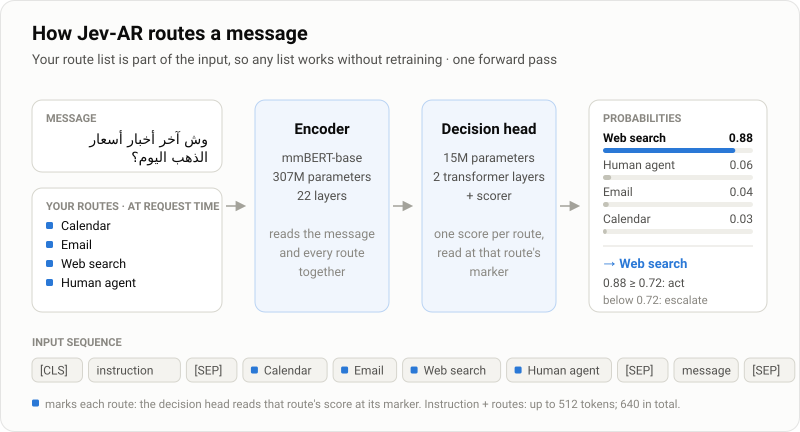

<div align="center">

# Jev-AR

### A 322M local decision model for fast Arabic intent routing across MSA, Gulf dialects and code-switched Arabic

[](https://huggingface.co/atmaneayoub/jev-ar)
[](https://huggingface.co/datasets/atmaneayoub/jev-ar-bench)


[](https://creativecommons.org/licenses/by-nc/4.0/)
[](LICENSE)

**83.4%** on 60-way Gulf-Arabic routing · **~10 ms** per query on one GPU · **322M** parameters · **runs locally**

</div>

Supply your routes at request time. Jev-AR scores them jointly in one forward pass and returns **the best route**,
**a probability for every route**, and **an escalation signal** for when it isn't confident enough to act.

<p align="center">
  
</p>

## Why Jev-AR

- **Your routes, at request time.** Pass any list (knowledge bases, queues, agents, tools) and change it on every
  call, with no retraining. On a kind of RAG app never seen in training, it routes 38 of 40 decisions
  correctly.
- **Gulf Arabic as people write it.** MSA, Emirati, Saudi, and Arabic mixed with English.
- **Knows when to hand off.** It gives calibrated probabilities and an `escalate` flag, set at a threshold fitted
  for 95% accuracy on development data.
- **Fast and local.** About 10 ms per query on one GPU, and 0.15–0.45 s on a laptop CPU. There is no API and no
  per-call cost, and your data stays on your machine.
- **Close to much larger systems.** On 60 routes it is 2.8 points from Jev 1.13 (a closed API) and 6.6 points from
  Qwen3.8-27B, at a fraction of their latency. On 20-route lists it is on par with Jev.

## 30-second example

The weights are gated. [Request access](https://huggingface.co/atmaneayoub/jev-ar) (approval is automatic), then:

```bash
pip install torch transformers huggingface_hub
hf auth login
```

```python
from jev_ar_route import JevAR

router = JevAR()  # downloads atmaneayoub/jev-ar on first use

routes = {
    "FAQ": "General how-to questions: claims process, insurance card, app, working hours, documents.",
    "Escalate to a human": "The user asks for a human agent, complains, or has an urgent problem.",
    "Benefits": "What the plan covers and how much: limits, co-payment, maternity, dental, optical.",
    "Nearest in-network provider": "Where the nearest in-network hospital or clinic is to a given place.",
}
router.route("ابغى اكلم احد من خدمة العملاء ضروري", routes)
# {'route': 'Escalate to a human', 'confidence': 0.93, 'escalate': False, 'probabilities': {...}}
```

[`jev_ar_route.py`](jev_ar_route.py) is one self-contained file that needs only `torch`, `transformers` and
`huggingface_hub`.

## How it works

<p align="center">
  
</p>

1. **One sequence.** The message and your routes are joined into one input, with a marker token before each route.
2. **Read together.** The mmBERT-base encoder reads the whole sequence, so each route is judged against the message
   and against the other routes.
3. **One score per route.** A 15M decision head scores every route at its marker. A softmax, with a temperature
   fitted on development data, turns the scores into probabilities. When the top probability is below 0.72,
   `escalate` is `True`.

Routes are part of the input, not fixed output classes, so a new list needs no retraining. The model was trained on
randomised, shuffled and reworded lists, so it can't rely on a route's position or exact wording. Shuffling the
60-route list changes 5.0% of its answers (Jev 1.13: 4.7%).

## Where it fits

```text
Agents    message → Jev-AR → tool / sub-agent / workflow
RAG       query   → Jev-AR → knowledge base → retrieval → LLM
Support   message → Jev-AR → billing / claims / FAQ / human
```

Use `escalate` to fall back to an LLM or a person. Each call takes about 60 short route names, or about 15–20 routes
with one-line descriptions (fewer in Arabic).

## API

**`JevAR(model="atmaneayoub/jev-ar", device=None, token=None)`** loads the model from a Hugging Face repo id or a
local folder, on `"cuda"` or `"cpu"` (picked automatically by default). `token` is a Hugging Face token with
access to the gated repo, if you aren't logged in.

**`router.route(text, routes=None, instruction=None)`** returns a dict:

| Argument | |
|:--|:--|
| `text` | the user's message |
| `routes` | `{name: description}` or a list of names. `None` uses the 60 built-in routes |
| `instruction` | the routing question. By default it is English or Arabic, following the route names |

| Field | |
|:--|:--|
| `route` | the best route's name |
| `confidence` | its probability |
| `escalate` | `True` when `confidence` is below 0.72, and always for *other service* on the built-in list |
| `probabilities` | every route's probability, highest first |
| `id`, `category`, `in_scope` | built-in list only: the route id, its category, and 1 − P(*out of scope*) |

From the command line:

```bash
python jev_ar_route.py "ابي اجدد الاقامة"
python jev_ar_route.py "وين أقرب فرع لكم في جدة؟" --routes '{"FAQ": null, "Nearest branch": null, "Complaints": null}'
```

**Built-in routes.** Called without a list, Jev-AR routes over 60 built-in routes: 58 Gulf government services
(residency, IDs, traffic, labour, business, housing, health, education and more), plus *other service* and *out
of scope*.

```python
router.route("ابي اجدد الاقامة")
# {'route': 'تجديد الإقامة', 'id': 'renew_residence', 'category': 'residency', 'confidence': 0.78,
#  'escalate': False, 'in_scope': 0.998, 'probabilities': {...}}
```

> **Tips.** The instruction plus the route list must fit in 512 tokens; the helper raises an error rather than
> silently cutting routes. On a CPU, call `torch.set_num_threads(8)` first. PyTorch's default of one thread per
> logical core is several times slower on laptop CPUs.

## Results

**Gulf-Arabic routing** ([Jev-AR Bench](https://huggingface.co/datasets/atmaneayoub/jev-ar-bench)): 4,974
held-out queries in MSA, Emirati, Saudi and code-switched Arabic. Accuracy in %, with 95% confidence intervals.

| Model | Params | Deployment | 60 routes | 20 routes | Latency (p50) |
|:--|:--:|:--:|:--:|:--:|:--:|
| Qwen3.8-27B (LLM, list in prompt) | 27B | GPU server | 90.0 | 94.0 | 634 ms † |
| Jev 1.13 (TypeSafe) | undisclosed | closed API | 86.2 | 91.4 | 370 ms † |
| **Jev-AR** | **322M** | **local** | **83.4** <sub>[81.2–85.4]</sub> | **90.0** <sub>[88.4–91.4]</sub> | **10 ms** |
| mmBERT-base, fine-tuned classifier | 307M | local | 76.5 | 79.8 | 6 ms |
| multilingual-E5-base + logistic regression | 278M | local | 72.4 | 77.4 | 4 ms |

<sub>Batch 1. Local models ran on an RTX 5090 Laptop GPU. † Client-side round trip, network included.</sub>

**Unseen-domain routing** ([Jev-AR Bench](https://huggingface.co/datasets/atmaneayoub/jev-ar-bench)): one RAG app
of a kind never seen in training, with 6 routes, and each question routed over an English and an
Arabic route list (40 decisions). Jev-AR scores **38 / 40**, with **0** answers changed when the list is
reversed. Jev 1.13 and Qwen3.8-27B score 40 / 40.

Per-dialect results, robustness and the evaluation protocol are on the
[model card](https://huggingface.co/atmaneayoub/jev-ar).

### Reproduce the unseen-domain benchmark

```bash
python benchmark/run_health_rag.py
# main score: 38/40  (English list 19/20, Arabic list 19/20; flips when reversed: 0 / 0)
```

## Limitations

- Trained on synthetic Arabic routing data, which has not yet been validated by native speakers.
- Confidence is calibrated on the built-in routes, so treat it as approximate on custom lists.
- It is not an official channel of any government or company. Keep a person in the loop for decisions with
  legal, medical or financial consequences.

## Licence

| Component | Licence |
|:--|:--|
| Model weights ([Hugging Face](https://huggingface.co/atmaneayoub/jev-ar)) | **CC BY-NC 4.0**: non-commercial use, testing and evaluation |
| Code in this repository | Apache-2.0 |
| Benchmark data | CC BY 4.0 |

**Commercial use** of the model needs a licence; contact **ayoubatmane23@gmail.com**. Third-party credits are in
[NOTICE](NOTICE).

## Citation

```bibtex
@misc{jevar2026,
  title        = {Jev-AR: Arabic Intent Routing for MSA, Gulf Dialects and Code-Switching},
  author       = {atmaneayoub},
  year         = {2026},
  howpublished = {\url{https://huggingface.co/atmaneayoub/jev-ar}}
}
```
